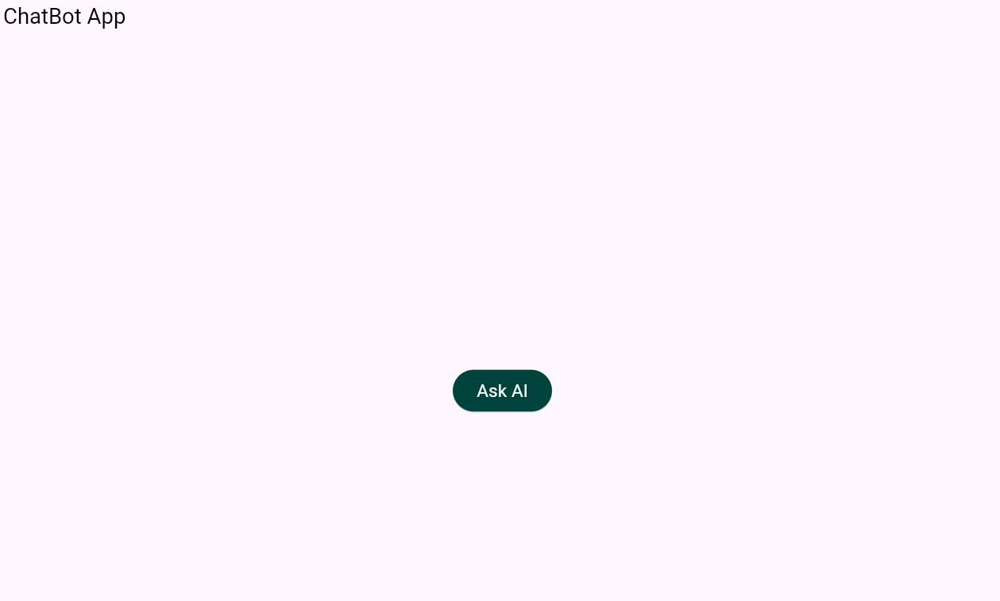
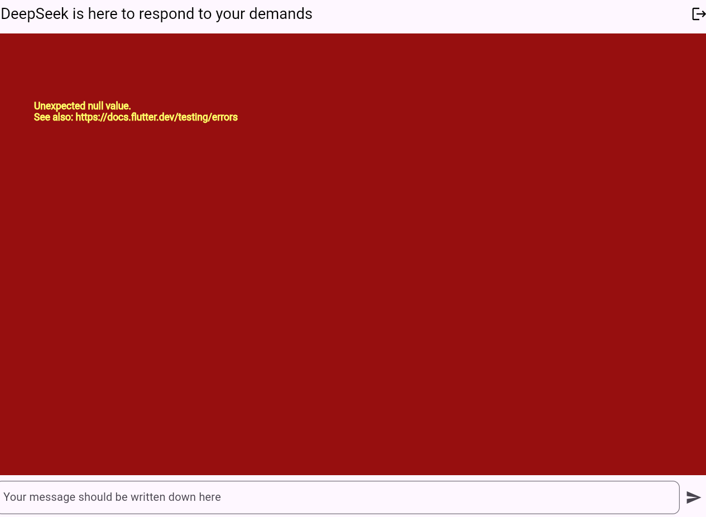

# deepseek_chatbot_app

Chatbot App builded, based on AI LLM and the Design Pattern Bloc

## Getting Started

# Page d'accueil

# Page du Initial State

# Premier Pending State

# Pending State Changed

# Error State

Objectif :

Développer une application mobile qui respecte la séparation de la logique UI et la logique applicative en utilisant BLOC Pattern comme solution de state management.
